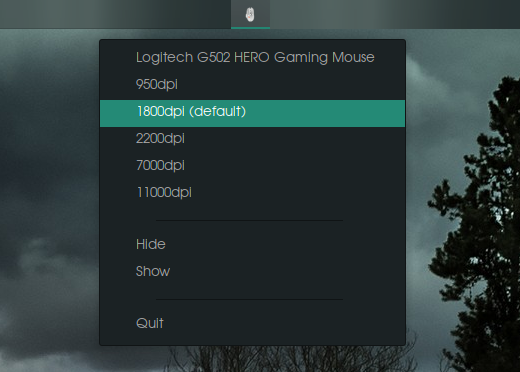

# OGI

OGI is the `ratbagctl` try icon to change the devices resolution. 

# Installation 

Ogi's dependencies: 
- [libratbag](https://github.com/libratbag/libratbag)

Dev build: 

- `npm i`
- `npm run tauri dev`

Production build: 

- `npm i`
- `npm run tauri build`
- Go to `src-tauri/target/release`
- Run the application `./ogi`

Issues: 
- Create new Issues [here](https://github.com/pawelswiszcz/ogi/issues)

Releases:
- [here](https://github.com/pawelswiszcz/ogi/releases)

# Stack: Tauri + Next.js + Typescript

## Recommended IDE Setup

- [VS Code](https://code.visualstudio.com/) + [Tauri](https://marketplace.visualstudio.com/items?itemName=tauri-apps.tauri-vscode) + [rust-analyzer](https://marketplace.visualstudio.com/items?itemName=rust-lang.rust-analyzer)